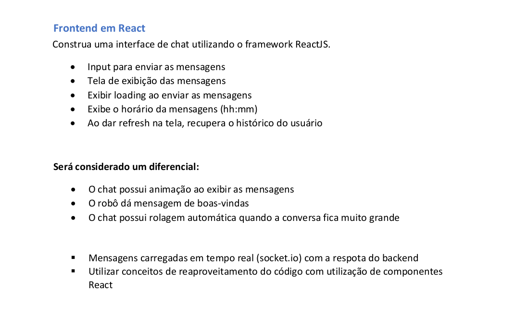
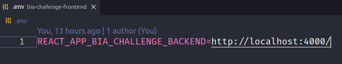
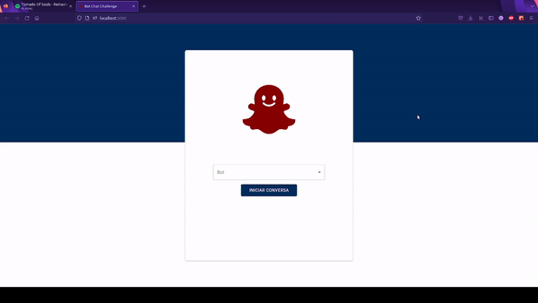

<h1 align="center">
  Desafio técnico – BIA - FrontEnd
  <br>
</h1>

<p align="center">
    <a alt="React">
        
    </a>
    <a alt="npm">
        
    </a>
    <a alt="NodeJs">
        
    </a>
    <a alt="JavaScript">
        
    </a>
    <a alt="Axios">
        
    </a>
        <a alt="MateriaUI">
        
    </a>
    <a alt="SocketIO">
        
    </a>
</p>

## Índice

1. [Descrição do desafio](#Descrição-desafio)
2. [Tecnologias](#Tecnologias)
3. [Instruções de uso](#Instruções-de-uso)
4. [Interface](#Interface)

## Descrição do desafio

</a>

## Tecnologias

Principais ferramentas e tecnologias utilizadas no projeto:

- **npm** - Gerenciador de dependências
- **JavaScript** - Linguagem de programação
- **ReactJS** - Biblioteca de JavaScript para construção de interfaces
- **NodeJS** - Interpretador JavaScript/TypeScript
- **SocketIO** - Protocolo de comunicação em tempo real

## Instruções de uso

**1. Clonar repositório**

**2. Start usando npm**

- Necessária uma conexão com a [Bia Challenge API](https://github.com/lucastavares10/bia-challenge-backend), configurar URL no .env do projeto antes de executar

</a>

```bash
npm install
npm start
```

Aplicação estará disponível em <http://localhost:3000>.

## Interface

</a>

- Para iniciar uma conversa é necessário ao menos um bot cadastrado no sistema ( [Bia Challenge API](https://github.com/lucastavares10/bia-challenge-backend) )

## Contribuidores

[Lucas Tavares](https://www.linkedin.com/in/lucas-tavares-a25323116/)
